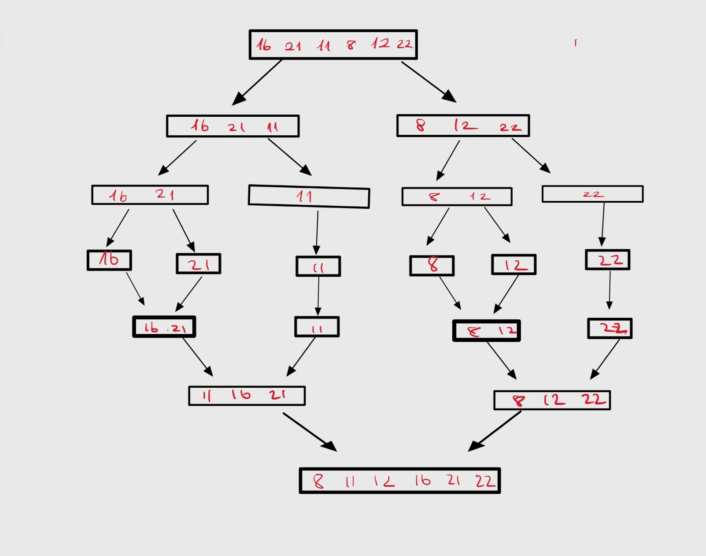

# Patika-Kodluyoruz-Veri-Yapilari-ve-Algoritmalar-Egitimi-Proje-Odevleri-icin-actigim-ilk-repo
Patika-Kodluyoruz Veri Yapılar ve Algoritmaları Projeler

[PROJELER](https://github.com/gulsahyesilmen/Patika-Kodluyoruz-Veri-Yapilari-ve-Algoritmalar-Egitimi-Proje-Odevleri-icin-actigim-ilk-repo/edit/main/README.md)
* ## Proje 1
  
   **[22,27,16,2,18,6]** &rarr;  Insertion Sort

   1. Yukarıda verilen dizinin sort türüne göre aşamalarını yazınız.
 
       **Cevap :**

      **[2,27,16,22,18,6]**
      
      **[2,6,16,22,18,27]**
      
      **[2,6,16,22,18,27]**
      
      **[2,6,16,18,22,27]**
      
      **[2,6,16,18,22,27]**

    2. Big-O Gösterimini yazınız.
 
       **Cevap :**
```math
 n+ (n-1)+(n-2)+...+1 = {n.(n+1) \over 2} = { n^2 + n \over 2}
``` 
    
olduğundan big-O gösterimi 


      
  ```math
O(n^2)
```
 olur.

**Time Complexity**

iii. Dizi sıralandıktan sonra "18" sayısı aşağıdaki case'lerden hangisinin kapsamına girer?

- Average Case: Aradığımız sayının ortada olması
- Worst Case: Aradığımız sayının sonda olması
- Best Case: Aradığımız sayının dizinin en başında olması

**Cevap :** Dizinin sıralanmış hali **[2,6,16,18,22,27]** olduğundan "18" sayısı Average Case kapsamına girer.

2.Soru : **[7,3,5,8,2,9,4,15,6]** dizisinin Selection Sort'a göre ilk dört adımını yazınız.

**Cevap :**

**[2,3,5,8,7,9,4,15,6]**

**[2,3,5,8,7,9,4,15,6]**

**[2,3,4,8,7,9,5,15,6]**

**[2,3,4,5,7,9,8,15,6]**

---

* # Proje 2

  **[16,21,11,8,12,22]** &rarr; Merge Sort

  -Yukarıdaki dizinin sort türüne göre aşamalarını yazınız.
  

